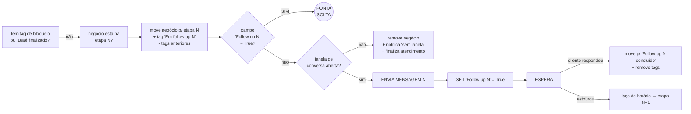

# 🔬 `Follow up - atualização` — anatomia

> [!info] Origem
> Migrada em 17/09/2026 do cofre da loja (`_Docs/automações datacrazy/FOLLOW UP - Anatomia do Fluxo.md`, Painel de Recompra). Conteúdo preservado na íntegra; leitura original do editor em 03/09/2026.

**ID do fluxo:** `6e45a009-f0b4-4ed7-9f53-c94ae7c4a2ff`
**Grupo:** Mensageiros · **Estado no editor:** ⚠️ com aviso
**Tamanho:** **208 nós** e 246 conexões — 70 condições, 55 ações, 15 blocos de mensagem, 8 operações de campo, 1 gatilho e 59 anotações.

> [!info] Como isto foi lido
> O JSON do fluxo foi extraído do estado interno do editor (todos os 208 nós, não só os visíveis na tela), e os contadores de execução foram lidos nó a nó percorrendo o canvas. Nada foi alterado.

---

## 1. O gatilho

```
message-sended-trigger  ×2   (5k execuções)
  ├─ Message-1  instância 6994840c514e31418c446776
  └─ Message-2  instância 6988930df408d466301b3e7e
  type: contains · keywords: []  → qualquer mensagem
  initializeSession: only-if-finished
  includeScheduledMessages: true
```

**O gatilho dispara quando a EMPRESA envia uma mensagem** — não quando o cliente para de responder. Toda mensagem que um vendedor manda reinicia o relógio do follow-up.

## 2. A trava de entrada

| Ordem | Nó | O que faz | Execuções |
|---|---|---|---|
| 1 | `314b7d9b` | O lead tem negócio em uma das 8 etapas de atendimento iniciado? | **5k** |
| 2 | `87edc5ee` | **A janela de conversa (24h) está aberta?** | **2k passam** |
| — | `e92e4653` | quem não passa → remove 3 tags e para | **3k** · ⚠️ **23 erros** |
| 3 | `2cc0918e` | Tem tag `Interno`, `Não receber follow-up` ou `Cliente ativo`? Se sim, sai. | 2k |
| 4 | `d4d442d6` | **ESPERA 15 min** | 3k |
| — | `8e3a1463` | cliente respondeu durante os 15 min → fim | 924 |

> [!danger] Primeira grande perda
> Dos **5.000** disparos, só **2.000** têm janela de conversa aberta. **60% do trabalho da automação é descartado antes de qualquer mensagem sair.**

## 3. O laço de horário (repete a cada etapa)

Depois de cada espera, três condições em cascata:

```
Seg–Sex 11:00–23:00Z  →  08:00–20:00 (local)   ✅ envia
Sáb     11:00–21:00Z  →  08:00–18:00 (local)   ✅ envia
Sáb 18:00 → Dom 12:00 (local)                  ⛔ encerra e limpa tags
qualquer outro horário                          ↩︎ volta para a espera
```

Fuso configurado: **`America/Bahia`** (deveria ser `America/Fortaleza`).

## 4. As 7 etapas — o bloco que se repete

Cada etapa N faz exatamente a mesma sequência de 9 passos:



## 5. A régua real — tempos e textos

| # | Espera antes | Acumulado | Texto enviado |
|---|---|---|---|
| — | 15 min | 0:15 | *(só espera)* |
| **1** | — | **0:15** | "Oi, {primeiro nome}! Ficou com alguma dúvida?" |
| **2** | 30 min | **0:45** | "Estou por aqui pra te ajudar! Posso te orientar melhor ou esclarecer qualquer dúvida. Hoje, o que você gostaria de entender melhor?" |
| **3** | 30 min | **1:15** | "Vi que você demonstrou interesse nesse móvel. Se precisar, posso verificar estoque, prazo de entrega e a melhor condição para você." |
| **4** | 45 min | **2:00** | "Se eu conseguir com meu gerente, entrega grátis para você o produto montado e você só paga na entrega, fechamos agora o seu pedido e garantimos sua entrega, fica bom assim pra você?" |
| **5** | 2 h | **4:00** | "{primeiro nome}, esse móvel é para sua casa, loja ou escritório?" |
| **6** | 2 h | **6:00** | "Ainda tenho seu atendimento aberto. Se quiser, posso deixar tudo preparado para você finalizar o pedido quando for mais conveniente." |
| **7** | 12 h | **18:00** | "Olá! Só para não te incomodar sem necessidade: você ainda tem interesse nesse móvel ou prefere encerrar o atendimento por enquanto? Se mudar de ideia, será um prazer te atende" ⚠️ *(texto cortado no meio da palavra)* |
| fim | 3 h | **21:00** | encerramento + perda do negócio |

**A régua inteira cabe em ~21 horas.** Depois disso o lead é encerrado e nunca mais tocado.

## 6. Como a espera é implementada (importante)

As 8 esperas **não** usam o bloco "Atraso de tempo" do Datacrazy. Usam o bloco **"Entrada do usuário"** (`text-input-message`) com prompt vazio e `timeoutInSeconds`:

```json
{ "text": "", "parameter": "", "acceptMediaUrl": true,
  "timeoutWaitType": "minutes", "timeoutInSeconds": 1800,
  "timeoutNextBlockId": "...",
  "invalidResponseMessage": "Poderia repetir, por favor?" }
```

Consequência: **enquanto espera, a automação segura a sessão de conversa do lead.** A resposta do cliente é capturada pela automação, não pelo atendimento — e existe uma `invalidResponseMessage` configurada ("Poderia repetir, por favor?") que pode ser disparada ao cliente.

## 7. Volumetria — o funil real da automação

| Etapa | Execuções |
|---|---|
| Gatilho disparado | **5.000** |
| Passou "atendimento iniciado" | 5.000 |
| **Passou "janela de conversa aberta"** | **2.000** |
| Criou negócio no funil de follow-up | **833** |
| **Mensagem 1 enviada** | **479** |
| Mensagem 2 enviada | 431 |
| Mensagem 3 enviada | 416 |
| Mensagem 4 enviada | 405 |
| Mensagem 5 enviada | 333 |
| Mensagem 6 enviada | 292 |
| **Mensagem 7 enviada** | **0** |
| Negócio marcado como perdido (`lose-business`) | **0** |

Clientes que **responderam durante a espera** (e o card foi movido para "Follow up N concluído"):

| Depois da msg | Responderam |
|---|---|
| 1 | 168 |
| 2 | 60 |
| 3 | 36 |
| 4 | 76 |
| 5 | 75 |
| 6 | 49 |
| 7 | 0 |

**464 pessoas voltaram a falar por causa do follow-up.** A automação gera conversa; o que não existe é o que acontece depois dela (ver [[ATD - Follow-up DataCrazy - Defeitos]], D6).

## 8. Campos e tags usados

**Campos adicionais:** `Follow up 1`, `follow up 2` *(minúsculo — inconsistente)*, `Follow up 3` a `Follow up 7`, `Lead finalizado?`. Todos gravados com o valor literal `True`. São zerados só no final do fluxo (`d3f5a14f`) — que tem **0 execuções**.

**Tags de bloqueio:** `Interno`, `Não receber follow-up`, `Cliente ativo`.
**Tags de estado:** `Em follow up 1` … `Em follow up 7` (adicionadas/removidas a cada etapa).

**Notificações configuradas** (todas para um único atendente, `8dd9a91e`):
- "O lead {nome} foi finalizado por falta de janela aberta" (+ variantes por etapa 4, 5, 6, 7)
- "O lead {nome} possui um erro inesperado" (+ variantes etapa 5 e 7) — **todas com 0 execuções**
- "O lead {nome} não possui atendente" — **0 execuções**

## 9. O que o próprio autor documentou (anotações do canvas)

O fluxo tem 59 anotações. Duas merecem destaque porque já anteciparam problemas:

> "Quando o negócio é perdido, é esperado que o card do lead seja movido da etapa encontrada para a etapa perda com o motivo de perda: *Não respondeu follow-up*. **O passo acima depende exclusivamente da automação de finalizar card e atendimento estar funcionando da forma correta, caso contrário não será movido para perda e nem finalizado o atendimento como esperado.**"

> "Caso esteja no intervalo Sáb 18h — Dom 12h não faz nada e apenas finaliza o follow up com o cliente. Caso não seja o intervalo acima, retorna o cliente para aguardar mais 2h antes de fazer uma nova verificação de horário."

## Ver também

[[ATD - Follow-up DataCrazy - Defeitos]] · [[ATD - Follow-up DataCrazy - Fluxo v2]] · [[000 - ATENDIMENTO (indice)]]
