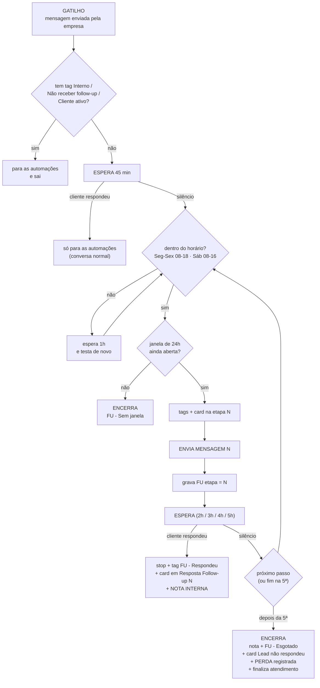

# 🧩 Follow up v2 — 24h, sem template, sem depender do vendedor

> [!info] Origem
> Migrada em 17/09/2026 do cofre da loja (`_Docs/automações datacrazy/FOLLOW UP v2 - Especificacao do Fluxo Importavel.md`, Painel de Recompra). Conteúdo preservado na íntegra; o JSON importável veio junto e está nesta mesma pasta.

**Arquivo para importar:** `Follow-up-v2-24h-Domoby.json` (nesta mesma pasta `Atendimento/`)
**Como importar:** Automações → ⋯ → Importar automação → selecionar o arquivo.

> [!warning] Ela entra DESLIGADA
> O arquivo vem com `active: false` de propósito. Depois de importar, revise no editor e só então ligue. **Antes de ligar, desligue a `Follow up - atualização`** — as duas rodando juntas dobrariam as mensagens no mesmo lead.

---

## O que mudou em relação ao fluxo atual

| | Hoje | v2 |
|---|---|---|
| Blocos | 208 | **67** |
| Mensagens ao cliente | 7 (3 delas iguais; a 7ª nunca saiu) | **5**, cada uma com um trabalho diferente |
| Duração da régua | ~21 h | **17h45** — cabe na janela de 24h com folga |
| Ramos que morrem em vazio | 14, com tráfego real | **0** |
| Lead marcado como perdido | nunca (0 execuções) | **sempre**, no encerramento único |
| Quando o cliente responde | nada acontece | tag + card + **nota interna na conversa** |
| Notificação para o vendedor | 12 ações (0 execuções) | **nenhuma, de propósito** |
| Horário | 08–20 / Sáb 08–18, fuso `America/Bahia` | **08–18 / Sáb 08–16**, fuso `America/Fortaleza` |
| Templates pagos (HSM) | necessários para a etapa 7 | **nenhum** |

---

## A régua

Contando a partir da última mensagem que a loja enviou (o gatilho):

| # | Espera | Acumulado | Papel da mensagem |
|---|---|---|---|
| — | 45 min | — | respiro: se o cliente responder aqui é conversa normal, a automação só se cala |
| **1** | — | **0h45** | fábrica própria + frete grátis/montado/paga na entrega + **pergunta a medida do vão** |
| **2** | +2 h | **2h45** | **pronta entrega** — informação nova, não repetição |
| **3** | +3 h | **5h45** | **quebra da objeção de preço** — parcelamento / Pix / paga na entrega |
| **4** | +4 h | **9h45** | prova social: fábrica e loja física em Natal, resolve problema |
| **5** | +5 h | **14h45** | última chamada: reserva do móvel + resposta 1️⃣2️⃣3️⃣ |
| fim | +3 h | **17h45** | encerra, registra a perda e finaliza o atendimento |

**Por que 5 e não 7:** no fluxo atual as mensagens 1, 2 e 3 são a mesma pergunta em 1h15, e a 7ª nunca foi enviada (0 execuções em 296 leads que chegaram lá — a janela de 24h já tinha fechado). Aqui cada mensagem carrega informação nova e a última sai com ~6h de folga antes da janela fechar.

**Por que a mensagem 3 é a de preço:** foi a maior causa de perda nos 126 atendimentos lidos — em 100% dos casos a objeção de preço encerrou a conversa sem resposta.

---

## O que a automação faz sozinha (nenhuma notificação)

### Quando o cliente responde, em qualquer ponto da régua

1. `stop-chat-automations` — solta a conversa na hora
2. remove as tags de follow-up e aplica **`FU - Respondeu`** → aparece na lista de conversas do Multiatendimento
3. move o card para **`Resposta Follow-up N`** → aparece no kanban
4. escreve uma **NOTA INTERNA dentro da própria conversa**:

> 🔔 O CLIENTE RESPONDEU AO FOLLOW-UP 3 (5h45 depois da última mensagem da loja).
> A automática parou sozinha. O card foi para "Resposta Follow-up 3" e o lead recebeu a tag "FU - Respondeu".
> Última mensagem automática enviada: …

Assim o vendedor não precisa olhar notificação nenhuma: ele vê a tag na lista, o card no funil e a nota quando abre a conversa.

### Quando a régua se esgota

Nota interna → tira as tags → aplica `FU - Esgotado` → move para **Lead não respondeu** → **`lose-business` com motivo "Não respondeu follow-up"** → grava `FU etapa = esgotado` → finaliza o atendimento.

### Quando a janela de 24h fecha no meio

Nota interna → `FU - Sem janela` → move para **Lead não respondeu** → grava `FU etapa = sem_janela` → finaliza.
**Não marca como perdido de propósito:** o lead não recebeu a régua inteira, e sujar o motivo de perda estraga o relatório. Fica com tag própria para ser filtrado.

---

## Estrutura técnica

**67 blocos:** 1 gatilho, 25 condições, 22 ações, 5 mensagens ao cliente, 7 notas internas, 11 esperas, 7 gravações de campo — mais 11 anotações explicativas no canvas.

### Regras que o desenho respeita

1. **Nenhum ramo termina em vazio.** Toda condição tem saída verdadeira e falsa apontando para um bloco real. (Validado: 0 pontas soltas, 0 blocos órfãos.)
2. **A janela de 24h é testada antes de cada envio** — nunca se tenta enviar o que não vai chegar.
3. **Não existe campo usado como tranca.** No fluxo atual os campos `Follow up N` nunca eram zerados e travavam o lead na reentrada; aqui `FU etapa` é só informativo. Quem impede sessão duplicada é o `initializeSession: only-if-finished` do gatilho.
4. **Não duplica card:** no passo 1, se o lead já tem negócio em "Follow-up 1" o fluxo move em vez de criar.
5. **Fim de semana não tem tratamento especial** — fora do horário espera 1h e testa de novo; quem passar da janela cai no encerramento correto.

---

## O que o arquivo cria na conta

**3 tags novas** (as 10 existentes são referenciadas pelo id, não recriadas):

| Tag | Cor | Para quê |
|---|---|---|
| `FU - Respondeu` | verde | o filtro que substitui a notificação |
| `FU - Esgotado` | cinza | régua completa sem resposta |
| `FU - Sem janela` | laranja | janela fechou no meio |

**1 campo adicional novo:** `FU etapa` (texto) — em que passo o lead está (`1`…`5`, `esgotado`, `sem_janela`).

Pipeline **Follow up**, motivo de perda **Não respondeu follow-up** e as 10 tags antigas são referenciados pelos ids que já existem na conta — o import mapeia, não duplica.

---

## ⚠️ Três coisas para conferir no editor antes de ligar

1. **Política de parcelamento.** A mensagem 3 fala em *"parcelado sem juros"* e *"desconto à vista no Pix"* **sem número**, de propósito: hoje circulam 3x, 5x e 7x sem juros na mesma semana e o desconto do Pix aparece em um atendimento só. Padronize e escreva o número.
2. **Nota interna.** Os 7 blocos de nota usam a marcação `isAnnotation` do bloco de mensagem. Confira no editor que eles estão como **anotação interna** e não como mensagem ao cliente — é a única coisa do arquivo que eu não pude testar em execução.
3. **Bloco de espera.** As 11 esperas usam "Entrada do usuário" com timeout, igual ao fluxo atual (é o que garante que o import funcione). Se preferir, troque cada uma pelo bloco **"Atraso de tempo"** — mais correto, porque não segura a sessão da conversa. Ao trocar, lembre de religar a saída "cliente respondeu".

---

## Como testar sem risco

1. Importar (entra desligada).
2. Abrir e conferir os 3 pontos acima.
3. Criar um lead de teste com o seu WhatsApp, marcar com a tag `Interno` e confirmar que ele **sai** do fluxo na trava de entrada.
4. Tirar a tag `Interno`, mandar uma mensagem pela loja e acompanhar: em 45 min deve chegar a M1.
5. Responder no meio e conferir os 4 efeitos automáticos (parou, tag, card, nota).
6. Só então: desligar a `Follow up - atualização` e ligar a v2.

## Ver também

[[ATD - Follow-up DataCrazy - Anatomia]] · [[ATD - Follow-up DataCrazy - Defeitos]] · [[ATD - Follow-up DataCrazy - Fluxo v2]]
