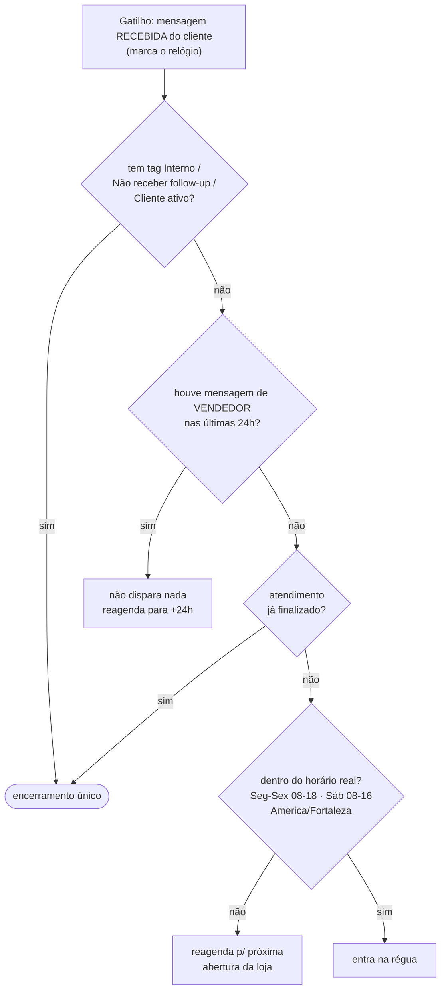
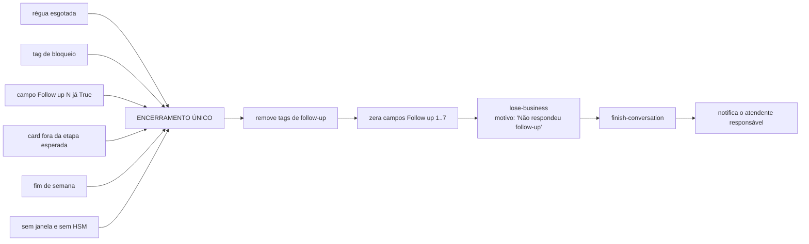
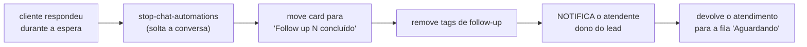

# 🛠️ Follow-up v2 — o fluxo que eu proporia

> [!info] Origem
> Migrada em 17/09/2026 do cofre da loja (`_Docs/automações datacrazy/FOLLOW UP - Fluxo Proposto v2.md`, Painel de Recompra). Conteúdo preservado na íntegra; proposta original de 03/09/2026.

Baseado em [[ATD - Follow-up DataCrazy - Anatomia]] e [[ATD - Follow-up DataCrazy - Defeitos]], e nos 126 atendimentos lidos na memória de atendimento ([[ATD - Por que Convertemos Pouco]]).

---

## Os 5 princípios

1. **Nunca competir com o vendedor.** Se houve mensagem humana nas últimas 24h, a automação cala a boca.
2. **Nunca gastar a janela de 24h com mensagem vazia.** Cada disparo precisa carregar informação nova.
3. **O ciclo do cliente é de dias, não de horas.** Móvel de R$ 300 a R$ 2.400 se decide medindo parede e conversando em casa.
4. **Todo lead termina com destino registrado.** Ganho, perdido com motivo, ou dormindo — nunca "sumiu".
5. **Quando o cliente responde, um humano é acionado na hora.** Reacender o lead sem entregá-lo a alguém é jogar dinheiro fora.

---

## A régua nova

| # | Quando | Bloco | Conteúdo | Precisa HSM? |
|---|---|---|---|---|
| 1 | **+20 min** | Atraso de tempo | Responde o que ficou pendente: **foto/vídeo do móvel exato + preço + a condição do bairro dele** ("no Cidade Verde eu consigo frete grátis, montado, e você paga na entrega") | não |
| 2 | **+3 h** | Atraso de tempo | **Informação nova**: prazo real de entrega / pronta entrega / medida — + uma pergunta fechada | não |
| 3 | **D+1, 09:00** | Atraso + janela de horário | "Ainda tenho seu atendimento aberto. Se quiser, posso deixar tudo preparado para você finalizar o pedido quando for mais conveniente." *(a atual msg 6 — é a melhor do conjunto)* | limítrofe |
| 4 | **D+3** | Template | **Prova social**: foto do móvel montado na casa de outro cliente do mesmo bairro | **sim** |
| 5 | **D+7** | Template | **Condição com prazo**: "essa condição de frete grátis + montagem eu seguro até sexta" | **sim** |
| 6 | **D+15** | Template | "Ainda quer continuar?" 1️⃣ Sim 2️⃣ Ainda analisando 3️⃣ Pode encerrar | **sim** |
| fim | — | Encerramento | `lose-business` com motivo → `finish-conversation` → limpa tags → zera campos | — |

> [!danger] A decisão que destrava tudo
> Do passo 4 em diante **a janela de 24h já estará fechada**. Sem **template aprovado (HSM)** pela Meta, nenhuma régua de dias existe — foi exatamente isso que matou a mensagem 7 do fluxo atual (0 envios, sempre). **Aprovar 3 templates é o pré-requisito de tudo.** Se a decisão for não usar HSM, a régua honesta tem só os passos 1, 2 e 3 — e é melhor assumir isso do que manter etapas que nunca rodam.

---

## A trava de entrada (guard) — antes de qualquer envio

**O item G2 é a correção mais barata e de maior efeito de todo este documento.** Ele sozinho resolve os 60% de atendimentos em que a automação atropelou o vendedor.

---

## O bloco único de encerramento

Hoje o `lose-business` está enterrado depois da etapa 7 e nunca roda. No v2 ele vira **um bloco só**, para onde **todas** as saídas apontam — as 14 pontas soltas incluídas:

Regra dura: **nenhum ramo pode terminar em vazio.** Se um ramo não tem o que fazer, ele vai para o encerramento.

---

## O ramo "cliente respondeu" — o que mais falta hoje

464 pessoas voltaram a falar por causa do follow-up e nenhuma foi entregue a um vendedor. O ramo correto:

---

## Mudanças estruturais

| Hoje | v2 | Por quê |
|---|---|---|
| 208 nós, 7 cópias do mesmo bloco | **~40 nós, 1 sub-fluxo parametrizado** | as cópias já divergiram entre si (D5). Uma cópia = um lugar para consertar. |
| Espera com "Entrada do usuário" + timeout | **"Atraso de tempo"** | para de sequestrar a sessão do lead e mata a `invalidResponseMessage` fantasma (D7) |
| Gatilho: mensagem **enviada pela empresa** | Gatilho: mensagem **recebida do cliente** + guard de 24h | o relógio deve contar o silêncio do cliente, não a fala do vendedor |
| Horário 08–20 / Sáb 08–18, fuso `America/Bahia` | 08–18 / Sáb 08–16, fuso **`America/Fortaleza`** | bater com o que a loja anuncia (D9, D10) |
| Campos `Follow up N` nunca zerados | zerados no encerramento único | hoje o lead reentra e morre nas pontas soltas (D2, D4) |
| Notificações só para 1 atendente fixo | notificar o **dono do lead** | quem precisa saber é quem está atendendo |

---

## O que reescrever nos textos

| # | Hoje | v2 |
|---|---|---|
| 1 | "Oi, {nome}! Ficou com alguma dúvida?" | responder o que ficou pendente + **foto do móvel** + preço + condição do bairro |
| 2 | "Estou por aqui pra te ajudar!… o que você gostaria de entender melhor?" | **eliminar** — é a 1 repetida (D13) |
| 3 | "Vi que você demonstrou interesse… posso verificar estoque, prazo e condição" | virar afirmação: "**Confirmei aqui**: esse tem pronta entrega e no seu bairro sai com frete grátis." |
| 4 | "Se eu conseguir com meu gerente…" | manter, **mas uma vez só e mais tarde** — alavanca de gerente só funciona se for rara (D15) |
| 5 | "esse móvel é para sua casa, loja ou escritório?" | **mover para a abertura** da conversa — é qualificação, não cobrança (D14) |
| 6 | "Ainda tenho seu atendimento aberto…" | **manter** — é a melhor da régua, só está no dia errado |
| 7 | "…será um prazer te atende" *(cortado)* | reescrever completo, virar template HSM com botões 1/2/3 (D11) |

---

## Roteiro de implantação sugerido

**Semana 1 — o que não precisa de aprovação de ninguém**
1. Ramo "cliente respondeu" passa a notificar o atendente (D6).
2. Guard de conversa viva 24h no gatilho.
3. Corrigir horário e fuso (D9, D10).
4. Fechar as 14 pontas soltas apontando para um encerramento único (D4, D5, D8).
5. Ligar de volta a automação `Finalizar cards` — o `lose-business` depende dela.

**Semana 2 — reescrita**
6. Reescrever as 7 mensagens conforme a tabela acima.
7. Trocar as esperas por "Atraso de tempo".
8. Consolidar os 7 blocos em um sub-fluxo único.

**Semana 3–4 — o que depende da Meta**
9. Submeter 3 templates HSM (prova social D+3, condição com prazo D+7, "ainda quer continuar?" D+15).
10. Ligar os passos 4, 5 e 6 da régua.

**Como saber se funcionou:** hoje o número honesto é **479 primeiras mensagens de 5.000 disparos** e **0 leads marcados como perdidos**. Depois da semana 1, o número a acompanhar é *quantos leads que responderam foram efetivamente atendidos por um humano em até 10 minutos*.

## Ver também

[[ATD - Follow-up DataCrazy - Anatomia]] · [[ATD - Follow-up DataCrazy - Defeitos]] · [[ATD - Por que Convertemos Pouco]]
